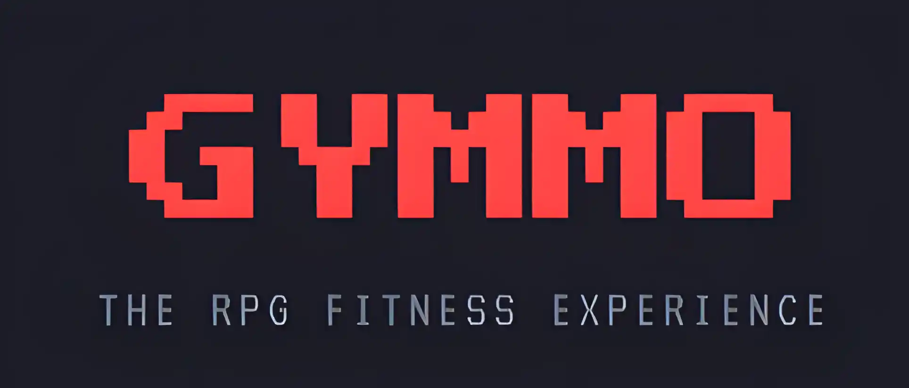

<h1 align="center">  ⚔️ Gymmo RPG: Tu Aventura Fitness </h1>

> **"No entrenes solo por salud... ¡Entrena para convertirte en una LEYENDA!"** 🏆

**Gymmo** transforma tu aburrida rutina de gimnasio en un épico **RPG de Acción**. Cada repetición es un golpe, cada entrenamiento una mazmorra, y cada gota de sudor te acerca al siguiente nivel. Construido con tecnología web moderna y estética Pixel Art retro.

---

## 🗺️ Mapa de Características

### 🔥 El Hub (Tu Base)
Tu centro de mando. Aquí visualizas tu progreso heroico:
- **Llama de Racha**: Mantén el fuego encendido entrenando diariamente.
- **Estado Vital**: Monitor de Hidratación 💧 y Proteína 🥩.
- **Misión Diaria**: Retos generados proceduralmente para ganar XP extra.
- **Oráculo**: Sugerencias inteligentes basadas en tu nivel de fatiga.

### 📜 El Grimorio (Base de Datos)
Una enciclopedia ancestral con **+500 Ejercicios** detallados:
- **Filtrado Mágico**: Busca por grupo muscular o nombre.
- **Instrucciones de Lucha**: Guías paso a paso para ejecutar cada movimiento a la perfección.
- **Variantes**: Diferentes técnicas (Mancuernas, Barra, Polea) para cada hechizo de fuerza.

### ⚔️ Zona de Combate (Entrenamiento)
Donde ocurre la magia. Una interfaz de batalla inmersiva:
- **Temporizador de Descanso**: No te enfríes, ¡la batalla continúa!
- **Registro de Daño**: Anota tus pesos, series y repeticiones.
- **Música de Batalla**: Efectos de sonido retro para cada logro.

### 🛡️ Perfil de Héroe
- **Nivel y Clase**: ¿Eres un Novato o un Guerrero Legendario?
- **Estadísticas RPG**: Fuerza, Resistencia y Voluntad que suben con tus actos.
- **Logros**: 36 medallas desbloqueables por hazañas heroicas.
- **Tarjeta de Gremio**: Comparte tu estatus con amigos mediante códigos visuales.

---

## �️ Tecnologías del Núcleo

Desarrollado con el stack más rápido del oeste:

- **Frontend**: Next.js 14 (App Router) ⚛️
- **Estilos**: Tailwind CSS + Framer Motion (Animaciones fluidas) 🎨
- **Estado**: Zustand (Persistencia local instantánea) 💾
- **Iconografía**: Lucide React + Pixel Art Custom 🗡️

---

## 🚀 Misión

Gymmo nació de una idea simple: **El fitness debería ser divertido**. Al aplicar mecánicas de videojuegos (XP, niveles, loot) al ejercicio, engañamos a nuestro cerebro para disfrutar del esfuerzo.

---

  Hecho con 💪 y ❤️ por <b> <a href="https://github.com/lazzzarito">1azarito</a> </b>

